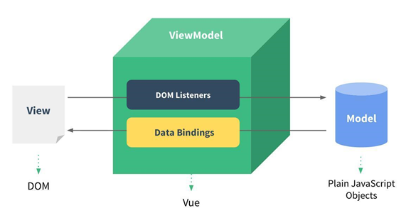

## Vue学习

学习视频： https://www.bilibili.com/video/BV17j411f74d?p=7&vd_source=e33a356475cf6a18a9f6345f4e44a209


### 一. 邂逅Vuejs

#### 1.1. 认识Vuejs

* 为什么学习Vuejs
* Vue的读音
* Vue的渐进式
* Vue的特点

#### 1.2. 安装Vue

* CDN引入
* 下载引入
* npm安装

#### 1.3. Vue的初体验

* Hello Vuejs
    * mustache -> 体验vue响应式

```html

<div id="app">{{message}}</div>
<script src="../js/vue.js"></script>
<script>
    //let (变量)/const 是一个常量
    //编程范式：声明式编程
    const app = new Vue({
        el: '#app', //用于挂载要管理的元素
        data: { // 定义一个数据
            message: 'hello Vue!'
        }

    })

</script>
```

* Vue列表展示
    * v-for
    * 后面给数组追加元素的时候, 新的元素也可以在界面中渲染出来
* Vue计数器小案例
    * 事件监听: click -> methods

#### 1.4. Vue中的MVVM
> MVVM是Model-View-ViewModel的简写. 它本质上就是MVC的改进版.
1. View层：
视图层
在我们前端开发中，通常就是DOM层。
主要的作用是给用户展示各种信息。
2. Model层：
数据层
数据可能是我们固定的死数据，更多的是来自我们服务器，从网络上请求下来的数据。
在我们计数器的案例中，就是后面抽取出来的obj，当然，里面的数据可能没有这么简单。
3. VueModel层：
视图模型层
视图模型层是View和Model沟通的桥梁。
一方面它实现了Data Binding，也就是数据绑定，将Model的改变实时的反应到View中
另一方面它实现了DOM Listener，也就是DOM监听，当DOM发生一些事件(点击、滚动、touch等)时，可以监听到，并在需要的情况下改变对应的Data。



#### 1.5. 创建Vue时, options可以放那些东西

* el:

  > 类型：string | HTMLElement
  > 作用：决定之后Vue实例会管理哪一个DOM。

>

* data:

  > 类型：Object | Function （组件当中data必须是一个函数）
  > 作用：Vue实例对应的数据对象。

>

* methods:

  > 类型：{ [key: string]: Function }
  > 作用：定义属于Vue的一些方法，可以在其他地方调用，也可以在指令中使用。
* 生命周期函数:


### 二.插值语法

* mustache语法
* v-once
* v-html
* v-text
* v-pre: {{}}
* v-cloak: 斗篷

1. Mustache语法(也就是双大括号)

```html
<div id = "app">{{message}}</id>
<script src= "../js/vue.js ">  </script>
<script>
        var app = new Vue({
                      el: "#app"，
                      data:{
                                message: 'hello Vue！'
                                }
                       }
          )
</script>
```

2. v-once 语法，绑定属性

> 在某些情况下，我们可能不希望界面随意的跟随改变

```html
<div id="app"> 
    <h2>{{message}}</h2> 
     <!--   v-once 是message 的值固定，无论如何不会发生改变--> 
            <h2 v-once>{{message}}</h2></div>
           <script src="../js/vue.js"> </script>
       <script> 
         const app = new Vue({   
                        el: '#app',   
                        data: {     
                        message: 'message' 
                         } 
                   }
            )
    </script>
```

3. v-html

> 在某些情况下，我们从服务器请求到的数据本身就是一个HTML代码
> 如果我们直接通过{{}}来输出，会将HTML代码也一起输出。
> 但是我们可能希望的是按照HTML格式进行解析，并且显示对应的内容。比如，从<a></a>中取出所有，或者从</img>

```html
   <div id="app"> 
        <h2>url</h2> 
             <!--  v-html 用于读取服务器返回的值是标签链接的时候，去掉标签链接显示--> 
        <h2 v-html='url'></h2></div>
   <script src="../js/vue.js"></script>
   <script> 
            const app = new Vue({   
            el: '#app',
            data: {     
            message: 'message',     
            url: '<a href="http://www.baidu.com">百度一下</a>'    }  })
   </script>
```

4.v-text

> v-textl作用和 Mustache相比较类似：都是将数据显示在界面中
> v-text通常情况下，接受一个string类型

```html
<div id="app"> 
      <h2>{{message}}</h2> 
          <!--   v- text 相当于message 但是因传递值存在覆盖值问题，故经常不使用--> 
          <h2 v-text="message">
          </h2></div>
   <script src="../js/vue.js"></script>
   <script> 
              const app = new Vue({   
                               el: '#app',   
                               data: {     
                               message: 'message'   
                               }  })
   </script>
```

5. v-pre

> 用于跳过这个元素和它子元素的编辑过程，用于显示Mustache 语法

```html
<div id="app"> 
<!--  v-pre 使message 不变--> 
       <h2 v-pre>{{message}}</h2>
</div>
<script src="../js/vue.js"></script>
<script>  const app = new Vue({
                              el: '#app',   
                              data: {     
                                       message: 'hello vue!'
                                       } 
      } )
</script>

```

6. v-cloak

> 用于显示出未编译出的Mustache标签

```html
<div id="app" v-cloak>{{message}}</div>
<script src="../js/vue.js"></script>
<script> 
//在vue解析之前，div中有一个属性v-cloak 
//在vue解析之后，div中没有属性v-cloak 
//setTime 时间等待，等待1s 
setTimeout(function (){   
                           const app = new Vue({
                                             el: '#app',     
                                             data: {       
                                             message: 'hello Vue!'
                                             }   
                                             }) 
   }, 1000)
  </script>
```

### 三. v-bind

#### 3.1. v-bind绑定基本属性

* v-bind:sr
* :href

1. v-bind 简单介绍

> 作用：动态绑定属性
> 缩写：:
> 预期：any (with argument) | Object (without argument)
> 参数：attrOrProp (optional)

2. v-bind 详细介绍

> 将值插入我们的模板内容
> 除了内容需要动态绑定决定外，某些属性我们也希望动态绑定
> 比如：动态绑定a元素的href属性
> 比如：动态绑定img元素的src属性
> v-bind用于绑定一个或多个属性值，或者向另一个组件传递props值(这个学到组件时再介绍)

- Vue实例中的data绑定元素的src和href

```html
<div id="app"> 
<h2>{{message}}</h2> 
        
       <a v-bind: href="aHref">百度一下</a>
       </div><script src="../js/vue.js"></script>
       <script>  const app = new Vue({   
                                    el: '#app',   
                                    data: {     
                                        message: 'hello Vue!',                                                imageUrl: 'https://cn.vuejs.org/images/logo.png', 
                                        aHref: 'http://www.baidu.com'   
                      } 
           })
    </script>
```

#### 3.2. v-bind动态绑定class

* 对象语法:
* 数组语法:

1. 对象语法：

   > 对象语法的含义是:class后面跟的是一个对象
   >

    - 用法一：直接通过{}绑定一个类
      `<h2 :class="{'active': isActive}">Hello World</h2> `
    - 用法二：也可以通过判断，传入多个值
      `<h2 :class="{'active': isActive, 'line': isLine}">Hello World</h2> `
    - 用法三：和普通的类同时存在，并不冲突

   > 注：如果isActive和isLine都为true，那么会有title/active/line三个类
   > `<h2 class="title" :class="{'active': isActive, 'line': isLine}">Hello World</h2>`
   >

    - 用法四：如果过于复杂，可以放在一个methods或者computed中

   > 注：classes是一个计算属性
   > `<h2 class="title" :class="classes">Hello World</h2>`

>

2. 数组语法：

   > 数组语法的含义是:class后面跟的是一个数组
   >

    - 用法一：直接通过{}绑定一个类
      `<h2 :class="['active']">Hello World</h2> `
    - 用法二：也可以传入多个值
      `<h2 :class=“[‘active’, 'line']">Hello World</h2> `
    - 用法三：和普通的类同时存在，并不冲突
      > 注：会有title/active/line三个类
      > `<h2 class="title" :class=“[‘active’, 'line']">Hello World</h2>`
   >
    - 用法四：如果过于复杂，可以放在一个methods或者computed中
      > 注：classes是一个计算属性
      > `<h2 class="title" :class="classes">Hello World</h2>`

>

#### 3.3. v-bind动态绑定style

* 对象语法:
* 数组语法:

### 四. 计算属性（computed）

* 案例一: firstName+lastName
* 案例二: books -> price


- [ ]  初见vue

### 一. 计算属性

#### 1.1. 计算属性的本质

* fullname: {set(), get()}

#### 1.2. 计算属性和methods对比

* 计算属性在多次使用时, 只会调用一次.
* 它是由缓存的

### 二. 事件监听

#### 2.1. 事件监听基本使用

#### 2.2. 参数问题

* btnClick
* btnClick(event)
* btnClick(abc, event) -> $event

#### 2.3. 修饰符

* stop
* prevent
* .enter
* .once
* .native

### 三. 条件判断

#### 3.1. v-if/v-else-if/v-else

#### 3.2. 登录小案例

#### 3.3. v-show

* v-show和v-if区别

### 四. 循环遍历

#### 4.1. 遍历数组

#### 4.2. 遍历对象

* value
* value, key
* value, key, index

#### 4.3. 数组哪些方法是响应式的

#### 4.4. 作业完成

### 五. 书籍案例

### 六. v-model的使用

#### 6.1. v-model的基本使用

* v-model => v-bind:value v-on:input

#### 6.2. v-model和radio/checkbox/select

#### 6.3. 修饰符

* lazy
* number
* trim

### 七. 组件化开发

#### 7.1. 认识组件化

#### 7.2. 组件的基本使用

#### 7.3. 全局组件和局部组件

#### 7.4. 父组件和子组件

#### 7.5. 注册的语法糖

#### 7.6. 模板的分类写法

* script
* template

#### 7.7. 数据的存放

* 子组件不能直接访问父组件
* 子组件中有自己的data, 而且必须是一个函数.
* 为什么必须是一个函数.

#### 7.8. 父子组件的通信

* 父传子: props
* 子传父: $emit

#### 7.9. 项目

* npm install
* npm run serve
